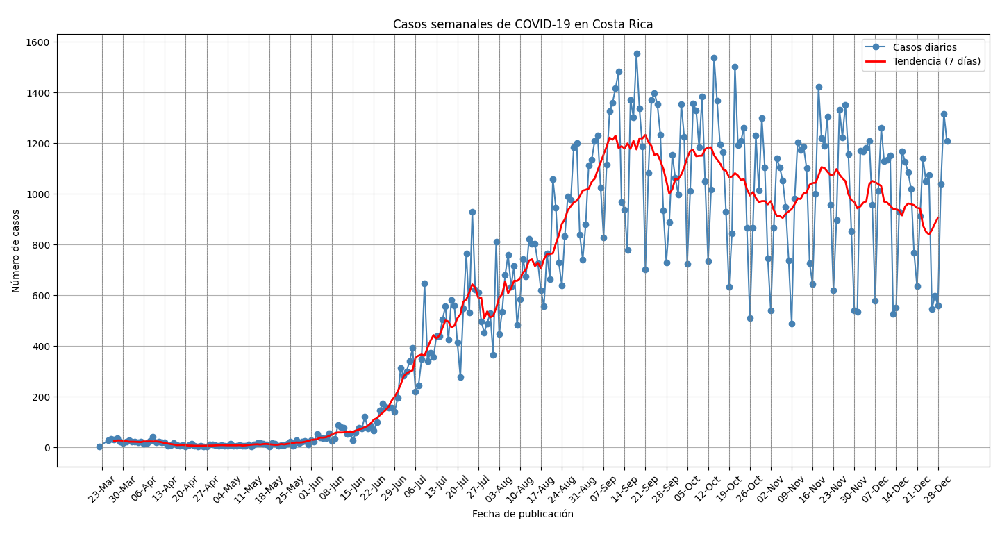
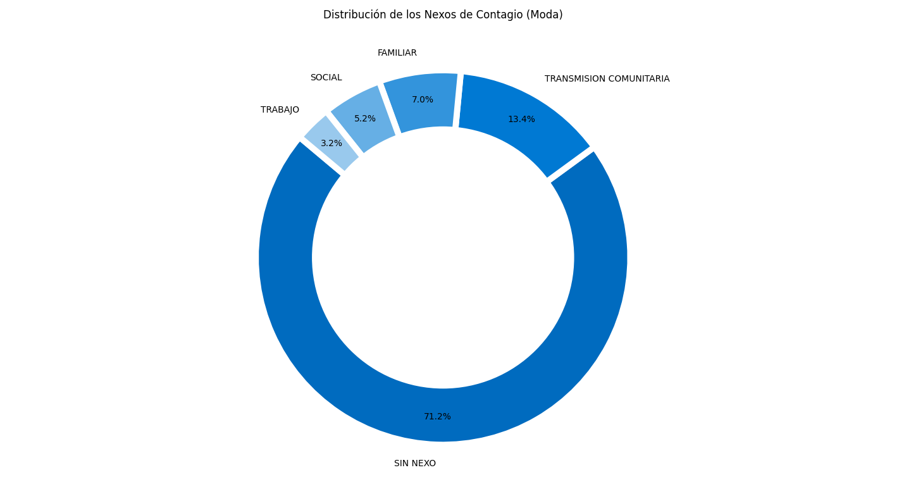
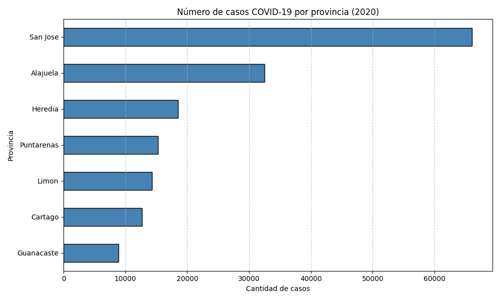

# covid19-costa-rica-public-health-analysis
A data-driven analysis of public health during the COVID-19 pandemic in Costa Rica (2020), focusing on national case trends, transmission patterns, and geographic distribution.
Made using Python (Pandas, Matplotlib) and Public datasets from Costa Rica’s Ministry of Health and national statistics institutions.

## 📌 Objective
To explore how data can be used to understand and communicate public health trends, especially during a national health crisis, using Costa Rica's 2020 COVID-19 data as a case study.

---
## 📊 Key Visualizations

1. **Weekly COVID-19 Cases in Costa Rica**  
A time-series chart illustrating the evolution of weekly case counts throughout the year (2020).
   
   

This chart shows the weekly progression of confirmed COVID-19 cases in Costa Rica throughout 2020. A sharp increase begins in mid-March, highlighting the early spread of the virus. The sustained growth from March 23 to September 7 reflects both improved testing capacity and rising community transmission—particularly in densely populated urban areas. The curve underscores the mounting pressure on the healthcare system and the uncertainty faced during the pandemic’s early phase.

---

2. **Distribution of Infection Links (Mode)**  
A categorical visualization identifying the most common sources of transmission (nexos de contagio).

   

This chart shows the percentage breakdown of identified sources of COVID-19 transmission in Costa Rica. Most notably, 71% of confirmed cases had no known source, reflecting both widespread community transmission and challenges in contact tracing during peak periods.

The next most common sources were local community spread (13.4%), household transmission (7%), and exposure in public places such as supermarkets and cinemas (5.2%). Only 3.2% of cases were linked to workplaces, which may suggest either more effective control measures or underreporting due to tracking limitations.

---

3. **COVID-19 Cases by Province (2020)**  
   A geographic map showing the distribution of confirmed cases across the seven provinces of Costa Rica.
   
   

This map displays the total number of confirmed COVID-19 cases across Costa Rica’s provinces in 2020, highlighting the unequal territorial impact of the pandemic. San José reported the highest number of cases (over 60,000), followed by Alajuela, Heredia, Puntarenas, and Limón. In contrast, Cartago and Guanacaste reported significantly fewer cases.

The concentration of infections in the Greater Metropolitan Area (GAM)—which includes San José, Alajuela, and Heredia—is linked to higher population density, mobility, and economic activity. Lower figures in provinces like Guanacaste may reflect not only reduced exposure but also limited testing and reporting capacity in rural or remote areas.

---
  
